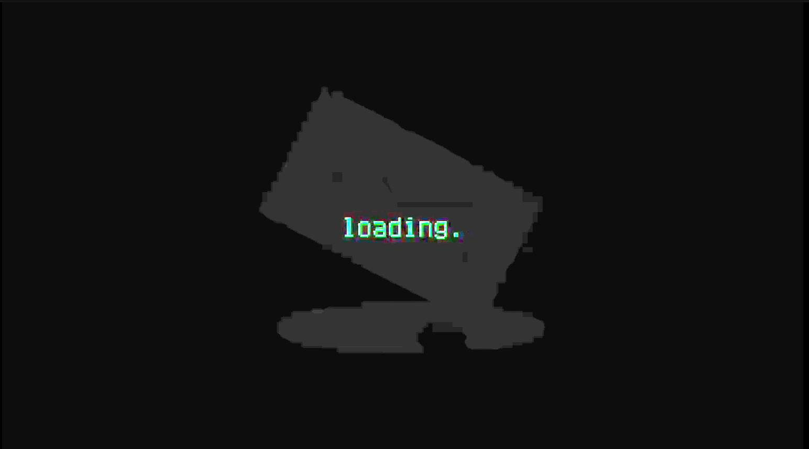

# ARG-20151222

**更新时间 `2025-07-22 18:00`**

## 须知
- 这里是新的文档，旧的文档请见 [README.old.md](README.old.md)
  
## 目录
- [ARG-20151222](#arg-20151222)
  - [须知](#须知)
  - [目录](#目录)
  - [放在前面](#放在前面)
    - [关于此ARG](#关于此arg)
    - [什么是ARG?](#什么是arg)
    - [加密解密常用工具](#加密解密常用工具)
  - [解析](#解析)
    - [0. 账号信息](#0-账号信息)
    - [1. \[视频\] Coming soon](#1-视频-coming-soon)
    - [2. \[动态\] Post a barrage to proceed to the next step](#2-动态-post-a-barrage-to-proceed-to-the-next-step)
    - [3. \[视频\] record20190722\_085432\_224655](#3-视频-record20190722_085432_224655)

## 放在前面
### 关于此ARG
- 此ARG围绕bilibili@**messager_mc** (旧称: aW50ZXJtZWRpYX 和 bili_20151222, UID: 3546831258651103)展开

### 什么是ARG?
- ARG是一种跨媒体、即时、不可逆的游戏，通常为解密类游戏

### 加密解密常用工具
- [RSA 加密/解密 - 锤子在线工具](https://www.toolhelper.cn/AsymmetricEncryption/RSA)
- [Base64 编码/解码 - 锤子在线工具](https://www.toolhelper.cn/EncodeDecode/Base64)
- [维吉尼亚密码在线加密解密 - 千千秀字](https://www.qqxiuzi.cn/bianma/weijiniyamima.php)
- [在线凯撒密码加密解密](https://www.lddgo.net/encrypt/caesar-cipher)
- [在线摩斯密码翻译器](https://www.lddgo.net/encrypt/morse)

## 解析
### 0. 账号信息
- 昵称 `aW50ZXJtZWRpYX` 经过 Base64 解码后得到 `intermediap`, 作用未知

### 1. [视频] Coming soon
> **动态** Coming soon  
> **时间** 2025-07-18 12:00:54  
> **BV**1augGzwEpr  
> **简介** -

- 视频全程只有文字 `Loading...`，经过画面调节后得到类似信封的图案
  

- 视频背景音频为低频噪声+高频摩斯电码 `..-. .. -. -.. .-. . -.-. --- .-. -..`，解码后得到 `FindRecord` (寻找录像?)
  
- 也许这是第二季的预告

### 2. [动态] Post a barrage to proceed to the next step
> **时间** 2025-07-18 12:10

- 译为 `发送弹幕以进行下一步`

### 3. [视频] record20190722_085432_224655
> **时间** 2025-07-22 17:24:29
> **BV**1zagHzTEub
> **简介** -

- 我吃个饭，待会再写