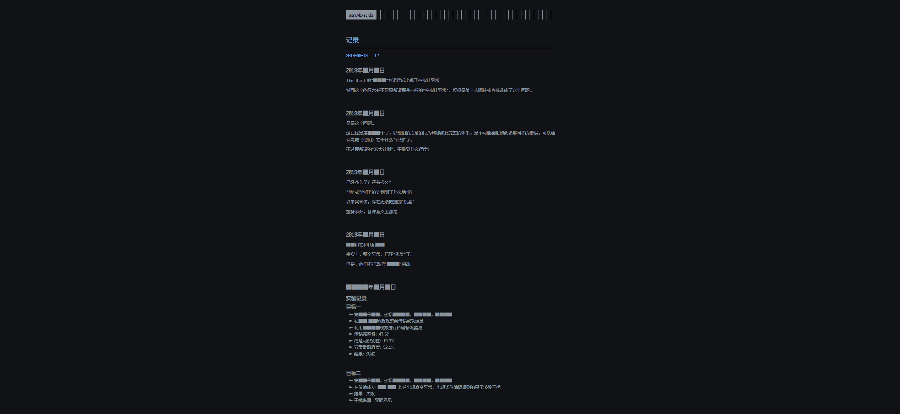
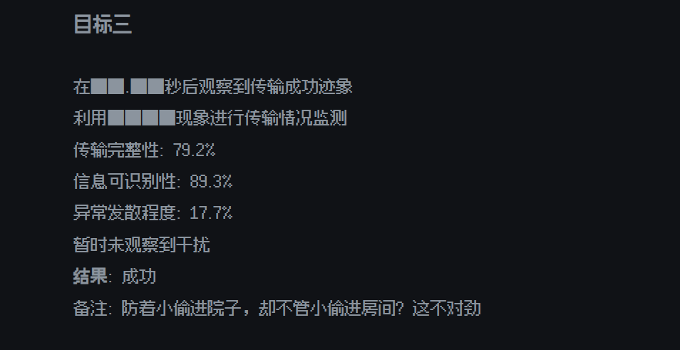
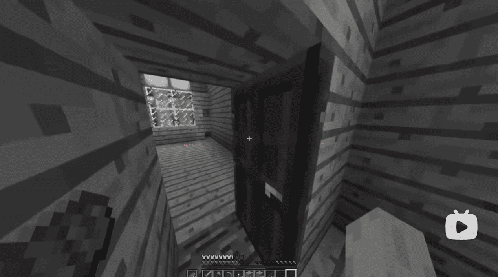
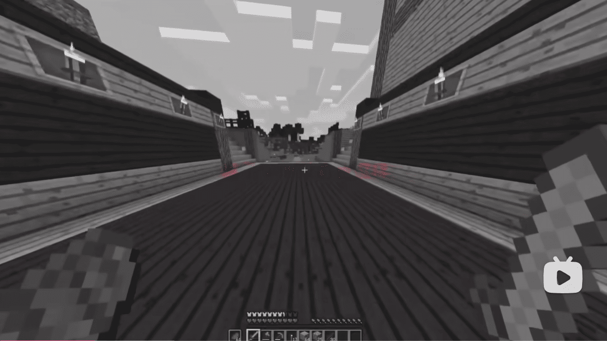
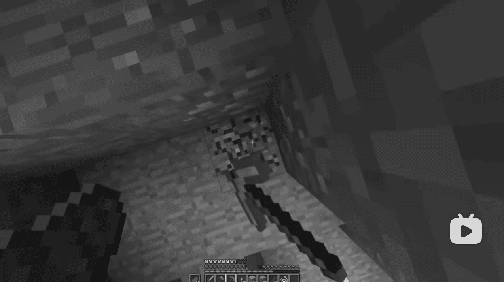
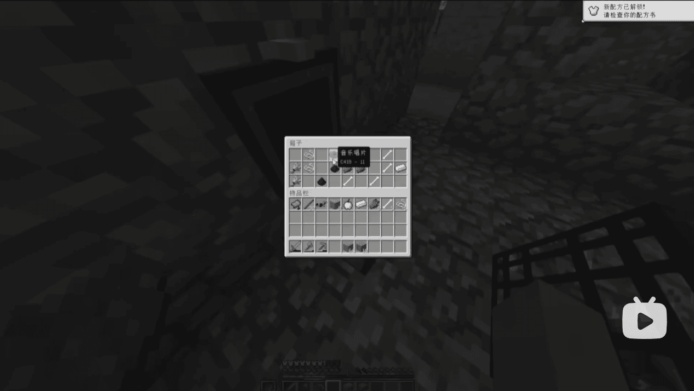
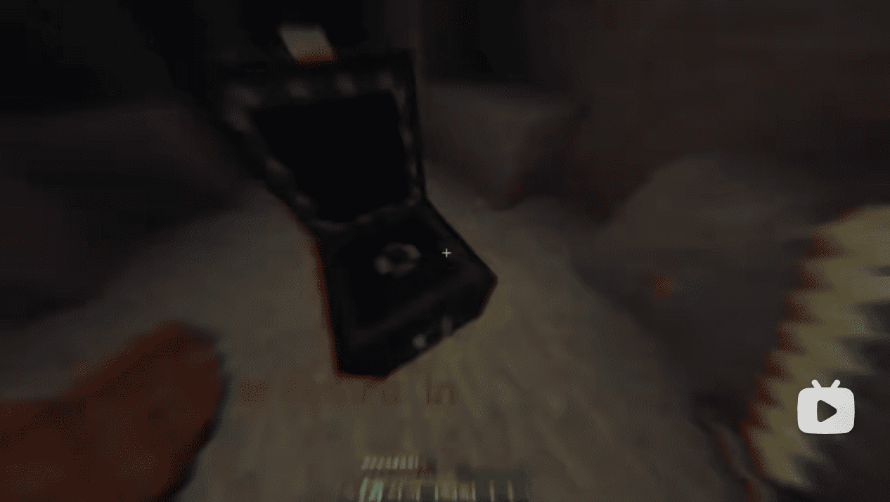

**更新时间 `2025-07-23 12:28`**

# 须知
- 这里是第二季的文档，旧的文档请见 [README.old.md](README.old.md)
- 更加权威的文档: [https://docs.qq.com/doc/DY0xTQnJSekZtU21P](https://docs.qq.com/doc/DY0xTQnJSekZtU21P)
  
# 目录
- [须知](#须知)
- [目录](#目录)
- [放在前面](#放在前面)
  - [关于此ARG](#关于此arg)
  - [加密解密常用工具](#加密解密常用工具)
- [发展](#发展)
  - [账号信息](#账号信息)
  - [1. \[视频\] Coming soon](#1-视频-coming-soon)
  - [2. \[动态\] Post a barrage to proceed to the next step](#2-动态-post-a-barrage-to-proceed-to-the-next-step)
  - [3. \[视频\] record20190722\_085432\_224655](#3-视频-record20190722_085432_224655)
    - [视频外信息](#视频外信息)
    - [视频内信息](#视频内信息)
  - [4. \[动态\] Interference release](#4-动态-interference-release)
  - [\[邮件\] 2025-07-23 00:20](#邮件-2025-07-23-0020)

# 放在前面
## 关于此ARG
- 此ARG围绕bilibili@**messager_mc** (旧称: aW50ZXJtZWRpYX 和 bili_20151222, UID: 3546831258651103)展开
- ARG是一种跨媒体、即时、不可逆的游戏，通常为解密类游戏

## 加密解密常用工具
- [RSA 加密/解密 - 锤子在线工具](https://www.toolhelper.cn/AsymmetricEncryption/RSA)
- [Base64 编码/解码 - 锤子在线工具](https://www.toolhelper.cn/EncodeDecode/Base64)
- [维吉尼亚密码在线加密解密 - 千千秀字](https://www.qqxiuzi.cn/bianma/weijiniyamima.php)
- [在线凯撒密码加密解密](https://www.lddgo.net/encrypt/caesar-cipher)
- [在线摩斯密码翻译器](https://www.lddgo.net/encrypt/morse)

# 发展
## 账号信息
- **旧**昵称 `aW50ZXJtZWRpYX` 经过 Base64 解码后得到 `intermedia`, 作用未知
- **现**昵称 `messager_mc`

## 1. [视频] Coming soon
> **动态** Coming soon  
> **时间** 2025-07-18 12:00:54  
> **BV**1augGzwEpr  
> **简介** -

- 视频全程只有文字 `Loading...`，经过画面调节后得到类似信封的图案  
  

- 视频背景音频为低频噪声+高频摩斯电码 `..-. .. -. -.. .-. . -.-. --- .-. -..`，解码后得到 `FindRecord` (寻找录像?)
  
- 也许这是第二季的预告

## 2. [动态] Post a barrage to proceed to the next step
> **时间** 2025-07-18 12:10

- 译为 `发送弹幕以进行下一步`

## 3. [视频] record20190722_085432_224655
> **时间** 2025-07-22 17:24:29  
> **BV**1zagHzTEub  
> **简介** -

- 视频长达9分17秒

### 视频外信息
- 视频背景音频为低频噪音＋频谱图隐写
    
  开头隐写 `are you all right?`  
    
  结尾隐写 [`www.gonethings.cloud`](https://www.gonethings.cloud)，这是一个网址  
    
- 网站标题为 `osrcvbxscxiz` (暂无意义)  
- 网站图标  
  {: width="100px"}
- 网页包含很多新闻，页脚为盲文 `from another world`，点击后跳转至 [www.gonethings.cloud/password](https://www.gonethings.cloud/password) (404)  
    
    
  网站有篇文章叫 `这里是你想来的地方吗？`，点击后跳转到 [https://www.gonethings.cloud/archives/1](https://www.gonethings.cloud/archives/1)，该页面有一张地铁站的图片，图片上有透明度极低的信封图案(网站图标)  
    
  图片点击后进入 [https://www.gonethings.cloud/■■■record](https://www.gonethings.cloud/%E2%96%A0%E2%96%A0%E2%96%A0record)  
  页面内容:
  ```
  记录
  2019-08-19 :: 12
  2019年■月■日
  The third 的"■■■"在运行后出现了空指针异常。"异常"？
  
  然而这个的异常并不只是所谓那种一般的"空指针异常"，疑似是某个人间接或直接造成了这个问题。
  
  看来他（他们）已经开始行动了
  
  2019年■月■日
  又是这个问题。
  
  这已经是第■■■个了，以他们的之前的行为和那如此完整的体系，是不可能会犯如此多那同样的错误。可以确  认是他（他们）在干什么"计划"了。
  
  不过那所谓的"宏大计划"，要做到什么程度？
  
  聚众为一以破限，从河流中爬上河岸，他们的野心，当真如此？
  
  2019年■月■日
  已经多久了？还有多久？
  
  "他"或"他们"的计划到了什么地步？
  
  以事实来讲，存在无法把握的"机会"
  
  置身事外，各种意义上都是
  
  如果墙阻挡了光线，就用镜子让光绕过去，这是唯一的方法
  
  2019年■月■日
  ■■仍在和我们■■
  
  事实上，那个异常，已经"修复"了。
  
  但是，他们不打算把"■■■"启动。
  
  依事实而言，这所谓的"计划"，并没有真正"终止"，依■■■的作风，这大概率只是换了个新包装而已
  
  ■■■■年■月■日
  实验记录
  目标一
  第■■号■■，坐标■■■■，■■■■，■■■■
  在■■.■■秒后观察到传输成功迹象
  利用■■■■现象进行传输情况监测
  传输完整性: 47.6%
  信息可识别性: 19.3%
  异常发散程度: 92.1%
  结果: 失败
  看来他们知道我们的■■了
  
  目标二
  第■■号■■，坐标■■■■，■■■■，■■■■
  在传输成功 ■■.■■ 秒后出现衰变异常，出现类似编码规则的量子波段干扰
  结果: 失败
  干扰来源: 显而易见
  ```
    
- 目标三下面有隐藏的文字，原文如下  
  

### 视频内信息
- 视频为 `yang_rewind`(主视角，简称Y) 和 `Richard_lee`(简称R) 的Minecraft实况视频，半程黑白，黑白部分有彩色片段
- 视频开头Y前往床上睡觉  
- `00:10` Y: `sleeeeeep` R: `ok。`  
- `00:20` 开门出现异常史蒂夫，Y说的话看不清，随后画面被吸入，闪白，切换场景  
  
- `00:25` Y: `今天我和理查德打算去挖矿，走吧`  
- `00:31` R: `行。`  
- `00:57` 闪过文字 `拿上我的装备`，红色文字似乎都是Y的心里话  
  
- `01:07` `这啥时候...`  
  
- `01:08` `算了，理查德在等我`  
  
- `01:24` `lee挂机了？`  
  
- `01:28` `算了，他以前也这样`  
  
- `01:31` `上次...上次啥时候` R: `去烧矿。`  
  
- `01:40` Y: `az，算了，我自己来`  
- `02:02` `铁`  
  
- `02:07` Y: `尼玛，三只小白`  
- `02:09` Y: `理查德过来帮忙一下`  
- `02:11` R: `来了。`  
- `02:22` `理查德`  
  
- `02:47` `他没带火把吗？`  
  
- `02:50` `我想有金苹果` Y: `woc，运气不错`，箱子里有仅一张11号唱片，但是被不明黑色色块挡住了，随后视频被裁剪  
  
- `02:52` `希望有金苹果`  
  
- `02:54` 火把突然熄灭
- `02:56` `嗯？`  
  
- `02:59` `lee呢，lee呢`  
  
- `03:02` Y: `怎么回事`  
- `03:12` Y: `网络延迟吗`  
- `03:24` 箱子里的物品变了
  
- `03:36` 合上箱子后 Y: `就这样吧，回去了`，同时画面快速花屏，切换场景，Y和R一起回家  
- `04:20` `放一下东西`  
  
- `04:32` `？这不对吧` 箱子里的东西是乱的  
  
- `04:34` `东西放完了` `真是充实的一天啊`  
  
- `04:19` 有玩家被打的声音
- `04:41` `lee在干嘛？`  
  
- `04:47` Y: `晚安理查德，好梦`，R: `晚安。`，转头走进房间  
- `04:59` `刚好听一下唱片`，唱片内容非原版11号唱片的内容  
  
- `05:16` `好听，睡了`，上床后画面色散，闪过刚才使用唱片机的画面  
  
- `05:19` 惊起 `什么玩意` `什么b动静`，唱片机发出原版11号唱片的声音  
  
- `05:23` `不对吧` 这里窗外有个末影箱  
  
- `05:27` `啊？` `还是先下矿去吧，没音乐睡不着`  
  
- `06:20` 到了矿洞 `怎么总感觉不对劲`  
  
- `06:46` `我好像，来过这里，为什么没有插火把？`  
  
- `06:56` `铁...`
- `08:47` `嗯？`  
  
- `08:50` 画面色散，箱子里只有一个11号唱片，声音卡顿，闪黑  
  
- `08:51` 转头出现史蒂夫(可能是R?)，随后被滤镜糊住  
  
- `08:53` `他疯了？？？？？？？？`，疯狂逃窜，出现很多蜘蛛，双重画面叠加  
  
- `08:58` 被蜘蛛击中 `他妈的哪来这么多蜘蛛`  
  
- `09:08` `死腿给我跳啊`  
  
- `09:13` 末影箱，打开里面有一个疑似11号唱片的物品  
  
- `09:14` 似乎有文字 `__ record in`，转头被 `Richard_lee` (已证实)击杀，黑屏，视频结束  
  
  

## 4. [动态] Interference release
> **时间** 2025-07-22 21:38  
>  

- 译为 `干扰释放`
- 这大概是因为视频太模糊所以发了个高清的
- 图1群u解出了一个邮箱 `cremrofnl@gmail.com` (解法看腾讯文档)
- 群u发了邮件(具体内容未知)后得到了回复  
  ```
  [bridge]You can only ask for help once a day, don't ask too many, otherwise I will be weakened. Someone is protecting us, I don't need to encrypt.
  liang
  ```
  译为  
  ```
  [桥梁]你一天只能求助一次，不要求助太多，否则我会变弱。有人在保护我们，我不需要加密
  梁
  ```
  后文邮件证实 `梁` 就是梁才奇
- 图2群u用字母表顺序解出了一下内容  
  
- 群u们提出了猜测  
  this is not home，this is a trap (这不是家，这是陷阱)  
  this is not home，this is third (这不是家，这是The Third)  

## [邮件] 2025-07-23 00:20
- 发件
  ```
  How many times will requesting help cause your strength to weaken? What is your full name? Is the final box your product?
  ```
  译为
  ```
  多少次的求助会导致你的力量变弱？你的全名是什么？末影箱(群u用的机翻)是做的吗？
  ```

- 来件
  ```
  More than 10 helps will cause my strength to weaken.
  LiangCaiQi.
  Yeah.The final box is my product.
  By the way,I can only answer three questions per email.
  ```
  译为
  ```
  超过10个求助会导致我的力量变弱
  梁才奇
  对，末影箱是我做的
  顺带一提，每封邮件我只能回答三个问题  
  ```