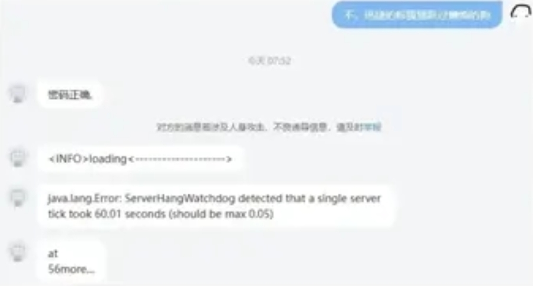
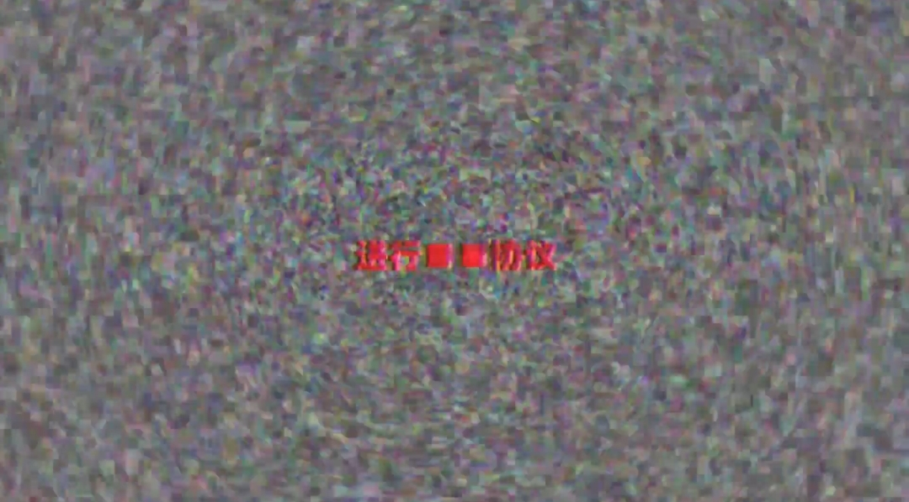

# ARG-20151222

## 放在前面
### 关于此ARG
- 此ARG围绕bilibili@**bili_20151222** (UID: 3546831258651103)展开
- 与此ARG相关的域名只有 `www.chipcraft.top`，其他子域及其他域名均与本ARG无关
- 此ARG与SCP基金会强关联
### 什么是ARG?
- ARG是一种跨媒体、即时、不可逆的游戏，通常为解密类游戏
### 关于此文档
- 部分素材来源于 bili_20151222 的QQ讨论群和 [(补档)bili_2015 arg解谜进度公示（1.11期） - 哔哩哔哩](https://m.bilibili.com/opus/1021255386614726657)
- 解读内容由群友和bilibili网友共同得出

## 解析
### 0. 作者主页介绍
作者主页介绍原文  
`utrUwsrHt/G6v73Qo78=`  

base64 GBK 解码得  
`黑月是否嚎叫？` (SCP基金会系列作品中的常见暗号)  

黑月是否嚎叫？（Does the black moon howl?）是网络共笔怪谈体系《SCP基金会》中的一句常见暗语。最早出现于SCP-256中

向作者私信 `不，迅捷的棕狐狸跃过懒惰的狗`

### 1. [视频] 20151222_060439_071658.mp4
> **动态** 10011000111→10011000110  
> **BV**1eEr6Y7EGS  
> **AV**113796366471023  
> **时间** 2025-01-09 11:55  
> **简介** `［no signal］`

- 动态是二进制，转为十进制为 `1223→1222`

- 视频 `00:08` 处花屏文字 `时间20151222? %←`
  

- 视频 `00:11` 处花屏文字 `信号传输受阻`
  

- 视频 `00:17` 处花屏文字 `进行■■协议`
  

- 视频 `00:23` 处花屏文字  
  `晚安，迎接你的下一个明天`  
  `晚安，迎接你的下一个昨天`
  