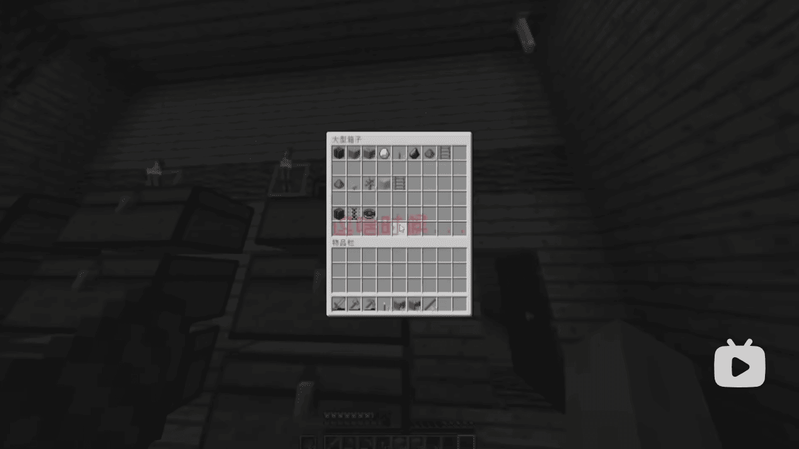
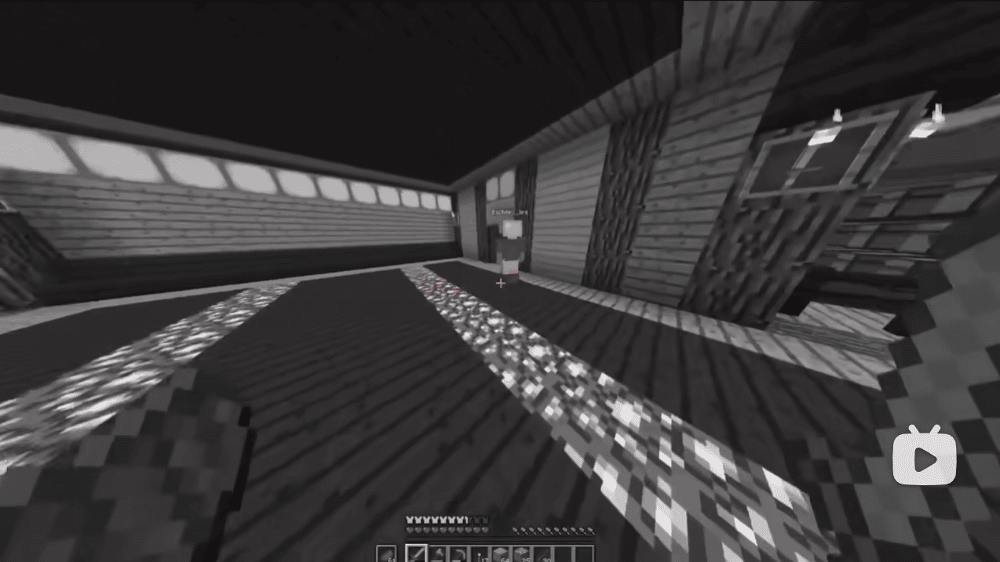
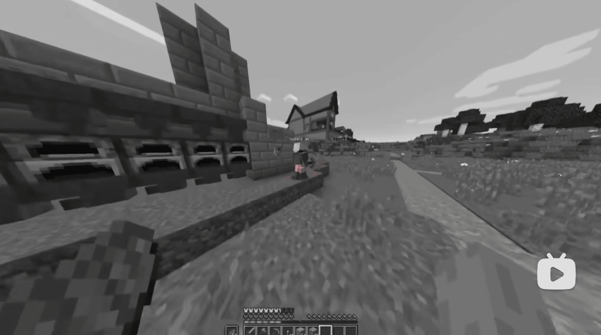
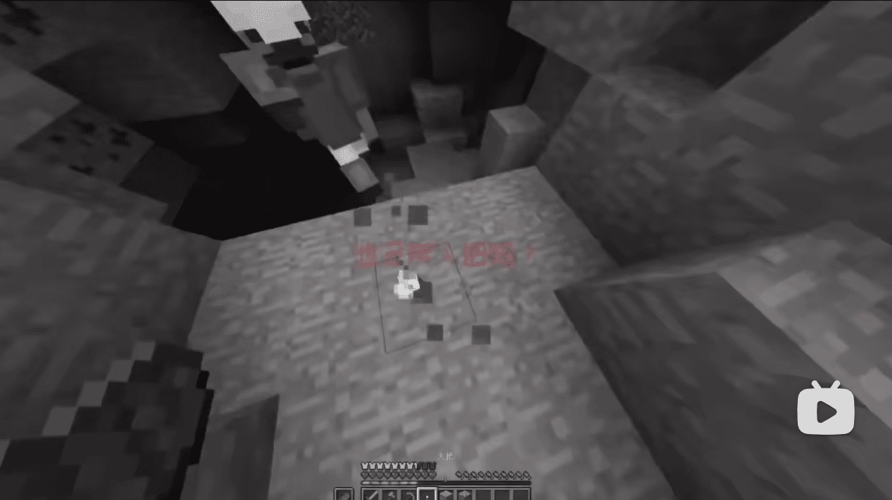
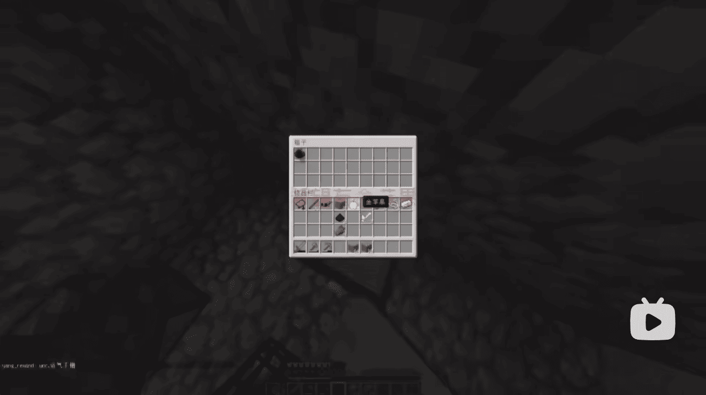
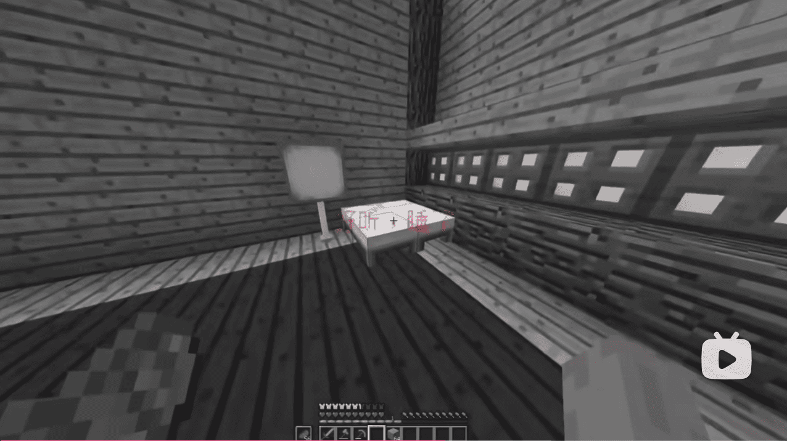
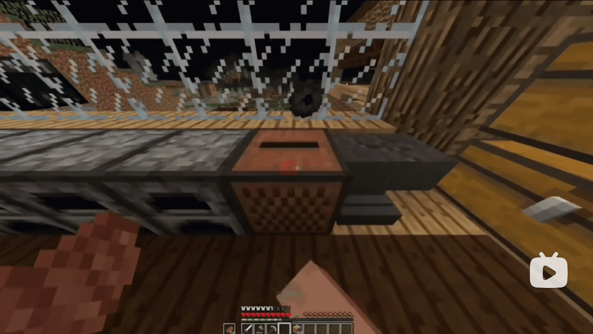

**更新时间 `2025-07-31 23:13`**
 
# 须知
- 这里是第二季的文档，旧的文档请见 [README.old.md](README.old.md)
- 更加权威的文档: [https://docs.qq.com/doc/DY0xTQnJSekZtU21P](https://docs.qq.com/doc/DY0xTQnJSekZtU21P)

# 目录
- [须知](#须知)
- [目录](#目录)
- [放在前面](#放在前面)
  - [关于此ARG](#关于此arg)
  - [加密解密常用工具](#加密解密常用工具)
  - [相关链接](#相关链接)
- [发展](#发展)
  - [账号信息](#账号信息)
  - [1. \[视频\] Coming soon](#1-视频-coming-soon)
  - [2. \[动态\] Post a barrage to proceed to the next step](#2-动态-post-a-barrage-to-proceed-to-the-next-step)
  - [3. \[视频\] record20190722\_085432\_224655](#3-视频-record20190722_085432_224655)
    - [视频外信息](#视频外信息)
    - [视频内信息](#视频内信息)
  - [4. \[动态\] Interference release](#4-动态-interference-release)
  - [\[邮件\] 2025-07-23 00:20](#邮件-2025-07-23-0020)
  - [5. \[视频\] record#1](#5-视频-record1)
  - [\[邮件\] 2025-07-24](#邮件-2025-07-24)
  - [\[邮件\] 2025-07-25](#邮件-2025-07-25)
  - [6. \[动态\] _无标题_](#6-动态-无标题)
  - [\[邮件\] 2025-07-26 23:02](#邮件-2025-07-26-2302)
  - [\[邮件\] 2025-07-28 12:31](#邮件-2025-07-28-1231)
  - [\[邮件\] 2025-07-29](#邮件-2025-07-29)
  - [7. \[视频\] record20190731\_095423\_112243](#7-视频-record20190731_095423_112243)
    - [视频外信息](#视频外信息-1)
    - [视频内信息](#视频内信息-1)

# 放在前面
## 关于此ARG
- 此ARG围绕bilibili@**messager_mc** (旧称: aW50ZXJtZWRpYX 和 bili_20151222, UID: 3546831258651103)展开
- ARG是一种跨媒体、即时、不可逆的游戏，通常为解密类游戏

## 加密解密常用工具
- [RSA 加密/解密 - 锤子在线工具](https://www.toolhelper.cn/AsymmetricEncryption/RSA)
- [Base64 编码/解码 - 锤子在线工具](https://www.toolhelper.cn/EncodeDecode/Base64)
- [维吉尼亚密码在线加密解密 - 千千秀字](https://www.qqxiuzi.cn/bianma/weijiniyamima.php)
- [凯撒(Caesar)加密/解密 - Bugku CTF平台](https://ctf.bugku.com/tool/caesar)
- [在线摩斯密码翻译器](https://www.lddgo.net/encrypt/morse)
- [RC2 加密/解密 - 锤子在线工具](https://www.toolhelper.cn/SymmetricEncryption/RC2)
- [Playfair Cipher - A.Tools](https://www.a.tools/Tool.php?Id=262)

## 相关链接
- [SCP-MC-625 - SCP基金会Minecraft分部](https://scp-wiki-mc.wikidot.com/scp-mc-625)
- [osrcvbxscxiz](https://www.gonethings.cloud/)  
  该网站内容的分析在 [3. 视频外信息](#视频外信息) 和 [7. 视频外信息](#视频外信息-1) 中  
  在 [`/■■■record`](https://www.gonethings.cloud/%E2%96%A0%E2%96%A0%E2%96%A0record) 中在地址栏输入以下内容可以看见隐藏文字(JS-CSS 代码注入)，注释请自己查看网页源代码  
  ```js
  javascript:(function(){var s=document.createElement('style');s.innerHTML='.transparent-text{color:white;opacity:1;background:#101216}';document.body.appendChild(s);})();
  ```
- [？？？](https://rebdstgonem.gonethings.cloud/)  
  该网站内容的分析在 [7. 视频外信息](#视频外信息-1) 中

本文档所有内容均由bilibili网友，交流群群友和我自己所分析得出的，由我自己撰写，翻译  
本文档很多内容来自交流群群友撰写的腾讯文档

# 发展
## 账号信息
- **旧**昵称 `aW50ZXJtZWRpYX` 经过 Base64 解码后得到 `intermedia`, 作用未知
- **现**昵称 `messager_mc`

## 1. [视频] Coming soon
_该视频已被删除_
> **动态** Coming soon  
> **时间** 2025-07-18 12:00:54  
> **BV**1augGzwEpr  
> **简介** -

- 视频全程只有文字 `Loading...`，经过画面调节后得到类似信封的图案  
  

- 视频背景音频为低频噪声+高频摩斯电码 `..-. .. -. -.. .-. . -.-. --- .-. -..`，解码后得到 `FindRecord` (寻找录像?)
  
- 也许这是第二季的预告

## 2. [动态] Post a barrage to proceed to the next step
> **时间** 2025-07-18 12:10

- 译为 `发送弹幕以进行下一步`

## 3. [视频] record20190722_085432_224655
> **时间** 2025-07-22 17:24:29  
> **BV**1zagHzTEub  
> **简介** -

- 视频长达9分17秒

### 视频外信息
- 视频背景音频为低频噪音＋频谱图隐写  
    
  开头隐写 `are you all right?`，结尾隐写 [`www.gonethings.cloud`](https://www.gonethings.cloud)，这是一个网址   
      
- 网站标题为 `osrcvbxscxiz`，副标题为 `crime`，标题似乎是普莱费尔(Playfair)密文，通过密钥 `crime` 解密得到 `lucewaslive`，意义不明    
- 网站图标  
  
- 网页包含很多新闻，页脚为盲文 `from another world`，点击后跳转至 [www.gonethings.cloud/password](https://www.gonethings.cloud/password) (404)  
     
  网站有篇文章叫 `这里是你想来的地方吗？`，点击后跳转到 [https://www.gonethings.cloud/archives/1](https://www.gonethings.cloud/archives/1)，该页面有一张地铁站的图片，暂无意义，图片上有透明度极低的信封图案(网站图标)  
    
  图片点击后进入 [https://www.gonethings.cloud/■■■record](https://www.gonethings.cloud/%E2%96%A0%E2%96%A0%E2%96%A0record)  
- 每一段及目标二下面有隐藏的文字(白色为隐藏的文字)  
  
- 新增内容请看 [7. 视频外信息](#视频外信息-1)

### 视频内信息
- 视频为 `yang_rewind`(主视角，简称Y) 和 `Richard_lee`(简称R) 的Minecraft实况(?)视频，半程黑白，黑白部分有彩色片段
- 视频的时间线似乎是乱的
- 视频开头Y前往床上睡觉  
- `00:10` Y: `sleeeeeep` R: `ok。`  
- `00:20` 开R房间的门出现异常史蒂夫(疑似R)，Y说的话看不清，随后画面被吸入，闪白，切换场景  
  
- `00:25` Y: `今天我和理查德打算去挖矿，走吧`  
- `00:31` R: `行。`  
- `00:57` 闪过文字 `拿上我的装备`，红色文字似乎都是Y的心里想法  
  
- `01:07` `这啥时候...`  
  
- `01:08` `算了，理查德在等我`  
  
- `01:24` `lee挂机了？`  
  
- `01:28` `算了，他以前也这样`  
   
- `01:31` `上次...上次啥时候` R: `去烧矿。`  
  
- `01:40` Y: `az，算了，我自己来`  
- `02:02` `铁`  
  
- `02:07` Y: `尼玛，三只小白`  
- `02:09` Y: `理查德过来帮忙一下`  
- `02:11` R: `来了。`  
- `02:22` `理查德`  
  
- `02:47` `他没带火把吗？`  
  
- `02:50` `我想有金苹果` Y: `woc，运气不错`，箱子里有仅一张11号唱片，但是被不明黑色色块挡住了，随后视频被裁剪  
  
- `02:52` `希望有金苹果`  
  
- `02:54` 火把突然熄灭
- `02:56` `嗯？`  
  
- `02:59` `lee呢，lee呢`  
  
- `03:02` Y: `怎么回事`  
- `03:12` Y: `网络延迟吗`  
- `03:24` 箱子里的物品变了  
  
- `03:36` 合上箱子后 Y: `就这样吧，回去了`，同时画面快速花屏，切换场景，Y和R一起回家  
- `04:20` `放一下东西`  
  
- `04:32` `？这不对吧` 箱子里的东西是乱的  
  
- `04:34` `东西放完了` `真是充实的一天啊`  
  
- `04:19` 有玩家被打的声音
- `04:41` `lee在干嘛？`  
  
- `04:47` Y: `晚安理查德，好梦`，R: `晚安。`，转头走进房间  
- `04:59` `刚好听一下唱片`，唱片内容非原版11号唱片的内容  
  
- `05:16` `好听，睡了`，上床后画面色散，闪过刚才使用唱片机的画面  
  
- `05:19` 惊起 `什么玩意` `什么b动静`，唱片机发出原版11号唱片的声音  
  
- `05:23` `不对吧` 这里窗外有个末影箱  
  
- `05:27` `啊？` `还是先下矿去吧，没音乐睡不着` 此时R房间的门和大门都被打开了  
  
- `06:20` 到了矿洞 `怎么总感觉不对劲`  
  
- `06:46` `我好像，来过这里，为什么没有插火把？`  
  
- `06:56` `铁...`
- `08:47` `嗯？`  
  
- `08:50` 画面色散，箱子里只有一个11号唱片，声音卡顿，闪黑  
  
- `08:51` 转头出现史蒂夫(可能是R?)，随后被滤镜糊住  
  
- `08:53` `他疯了？？？？？？？？`，疯狂逃窜，出现很多蜘蛛，双重画面叠加  
  
- `08:58` 被蜘蛛击中 `他妈的哪来这么多蜘蛛`  
  
- `09:08` `死腿给我跳啊`  
  
- `09:13` 末影箱，打开后Y把11号唱片放了进去  
  
- `09:14` 似乎有文字 `__ record in`，转头被 `Richard_lee` (已证实)击杀，黑屏，视频结束  
  
  

## 4. [动态] Interference release
> **时间** 2025-07-22 21:38  
>  

- 译为 `干扰释放`
- 这大概是因为视频太模糊所以发了个高清的
- 图1群u解出了一个邮箱 `cremrofnl@gmail.com` (解法看腾讯文档)
- 群u发了邮件(具体内容未知)后得到了回复  
  ```
  [bridge]You can only ask for help once a day, don't ask too many, otherwise I will be weakened. Someone is protecting us, I don't need to encrypt.
  liang
  ```
  译为  
  ```
  [桥梁]你一天只能求助一次，不要求助太多，否则我会变弱。有人在保护我们，我不需要加密
  梁
  ```
  后文邮件证实 `梁` 就是梁才奇
- 图2群u用字母表顺序解出了一下内容  
  
- 群u们提出了猜测  
  this is not home，this is a trap (这不是家，这是陷阱)  
  this is not home，this is third (这不是家，这是The Third)  

## [邮件] 2025-07-23 00:20
- 发件
  ```
  How many times will requesting help cause your strength to weaken? What is your full name? Is the final box your product?
  ```
  译为
  ```
  多少次的求助会导致你的力量变弱？你的全名是什么？末影箱(群u用的机翻)是做的吗？
  ```

- 来件
  ```
  [bridge]
  More than 10 helps will cause my strength to weaken.
  LiangCaiQi.
  Yeah.The final box is my product.
  By the way,I can only answer three questions per email.
  ```
  译为
  ```
  超过10个求助会导致我的力量变弱
  梁才奇
  对，末影箱是我做的
  顺带一提，每封邮件我只能回答三个问题  
  ```

## 5. [视频] record#1
> **时间** 2025-07-23 23:06:56  
> **BV**1vc8wzxEzT  
> **简介** -

- 视频全程有阴间滤镜，但是打开箱子指向 `java.lang.NullPointerException` (空指针异常) 时画面恢复正常，经验值为 `2118` 级  
  

- 值得注意的是，地板似乎是某种意义不明的图案。传送门火焰(?)定格似乎与网站的儿童失踪新闻相符  
   

- 暂时没看出什么有效信息

## [邮件] 2025-07-24
- 发件
  ```
  Can you talk about the relationship between messager, The third and 625 from your purpose and your camp
  ```
  译为
  ```
  能不能从你的目的和立场谈谈messager，The third和625(scp-mc-625)的关系？
  ```

- 来件
  ```
  [bridge]It's hard to say.
  I haven't too much time to see these content.Don't ask too much questions.
  As far as I know,625 is one of the Anomalies of The Third subordinate.
  About Messenger,I can't tell you now.This may lead to bad results.
  Liang
  ```
  译为
  ```难说。
  我没有太多时间去看这些内容，请勿追问过多。
  据我所知，625是The third下属的异常之一。
  关于messager，现在不能告诉你，这可能会造成不好的影响。
  —— 梁才奇
  ```

## [邮件] 2025-07-25
> **发件时间** 2025-07-22 or 23(?)

- 发件
  ```
  WHO R U
  ```

- 来件
  ```
  [bridge]Okey.
  I
  ```
  _~~瞎几把乱回这是~~_

## 6. [动态] _无标题_
> **时间** 2025-07-25 18:12  
> ```
> Technical details of permanent failure:
> Google tried to deliver your message, but it was rejected by the server for the
> recipient domain by aspmx.l.google.com. [Error:ECB].
> 
> The errorhat the other server returned was
> 451-1.1The email server temporarily rejected this message.
> 451-5.1.1 double-checking the recipient's email address for typos or "RC2"
> 451-5.1.1 That is not him.
> 451-5.1.1 https://support.google.com/mail/answer/3726730
> dwx1G1Fl/5IGfzLCVAs3v3DRDdgDVQ9PoWi6JleJYhQ= - gsmtp
> ```

- 译为
  ```
  永久性失败的技术细节：
  Google尝试投递您的邮件，但被收件方域名的服务器aspmx.l.google.com拒绝。[错误代码：ECB]
  
  对方服务器返回的错误信息为：
  451-1.1 邮件服务器暂时拒绝了此消息。
  451-5.1.1 请仔细检查收件人邮箱地址是否存在拼写错误或"RC2"
  451-5.1.1 该地址并非其本人(这不是他)。
  451-5.1.1 详情请参阅：https://support.google.com/mail/answer/3726730
  dwx1G1Fl/5IGfzLCVAs3v3DRDdgDVQ9PoWi6JleJYhQ= - gsmtp
  ```

- 末行 `dwx1G1Fl/5IGfzLCVAs3v3DRDdgDVQ9PoWi6JleJYhQ=` 是RC2 ECB算法密文，`gsmtp` 是密钥，解密后得到
  ```
  Don't worry.It will be fine.
  ```
  译为
  ```
  不用担心，一切都会好起来的。
  ```
- 该错误在 [`Gmail SMTP 错误和代码`](https://support.google.com/mail/answer/3726730) 页面中并不存在

## [邮件] 2025-07-26 23:02
- 发件
  ```
  TheThird.png
  ```
  _~~瞎几把乱发这是~~_

- 来件
  ```
  [bridge]I don't understand what you mean. This is the symbol of The Third; they are the masterminds behind all of this. During a previous incident, I seized the chance to start resisting them.I don't know what you want. Please give me clear instructions so that my waning strength can count for something.
  ```
  译为
  ```
  我不明白你的意思。这是The Third的象征;他们是这一切的幕后主使。在上次的事件中，我抓住机会开始反抗他们。我不知道你想要什么。请给我明确的指示，让我日渐衰弱的力量能派上用场。
  ```

## [邮件] 2025-07-28 12:31
- 发件
  ```
  mean this?
  "luce was live"?
  ```
  译为
  ```
  是这个意思吗？
  "luce was live" (Luce 曾活着/Luce 在直播/?)？
  ```

- 来件
  ```
  [bridge]Well...you got me on that one.
  I don't know who is Luce.New victim?
  I DON'T KNOW WHAT IS FUCKING MEANING FOR YOU!I can't distinguish whether all the messages are meaningful or not.
  So,what's the point of what you're saying?Wasting my strength?Now,I will become weak after 5 helps.DON'T WASTE YOUR HELPS.
  Liang
  ```
  译为
  ```
  好吧... 这次你难倒我了。
  我不知道 Luce 是谁。新的受害者吗？
  我他妈根本不懂你在说什么！我无法分辨这些信息到底有没有意义。
  所以你说这些的用意是什么？浪费我的力气？现在我只能再帮5次就会变得虚弱。别浪费你的求助机会。
  —— 梁才奇
  ```

## [邮件] 2025-07-29
- 发件
  ```
  l'm very sorry for the previous stupid email. I just decoded osrcvbxscxiz and got this seemingly useful piece of information. Please forgive.
  And we want ask you for your health. Are you still all right? This will contribute to our progress.
  (This is not an email asking for help.)
  ```
  译为
  ```
  对于之前那封愚蠢的邮件，我深感抱歉。我刚破译了osrcvbxscxiz并得到了这条看似有用的信息，请原谅。
  我们还想询问您的健康状况，您一切都还好吗？这将有助于我们的进展。
  （这不是一封求助邮件。）
  ```

- 来件
  ```
  [bridge]I just hope our cooperation can be more efficient.
  The situation is getting more serious.So bad news.
  The interference from T3 is getting more stronger.So,replying to every word consumes a lot of effort.
  So,I repeat:DON'T WASTE YOUR HELP.
  ```
  译为
  ```
  我只希望我们的合作能更高效些。
  情况正变得越来越严峻，真是糟糕。
  来自T3的干扰正变得越来越强，因此，回复每个字都需要耗费大量精力。
  所以我再次强调：不要浪费你们的求助机会。
  ```

## 7. [视频] record20190731_095423_112243
> **时间** 2025-07-31 14:39:30  
> **BV**1ec81z5E6S  
> **简介** reBdstGoneM+

### 视频外信息
**背景音乐**
- 视频背景音乐为多种唱片音乐叠加和切换  
  `far+ward` > `mall` > `ward` > `ward+stal` > `mellohi+otherside` > `stal` > `far` > `stal`
- 根据简介，把每个唱片的红石强度排列(叠加的音乐红石强度相加)  
  `15 6 10 18 21 8 5 8` (意义不明)

**网站内容变更**
- `www.gonethings.cloud/■■■record` 页面有新的明文，隐藏文字(白色为隐藏的文字)和HTML注释(黄色为注释内容)  
    
  _(图片转自腾讯文档)_

**网站新内容**
- 通过视频简介和域名拼接得到新的可访问域名 [`rebdstgonem.gonethings.cloud`](https://rebdstgonem.gonethings.cloud)
- 网站背景是 `record20190722_085432_224655`，网站似乎是一个弹幕小游戏，`A` `D` 移动，`空格` 跳跃，掉下去会死，意义不明  
  该网站暂未完成  
  

### 视频内信息
- 视频似乎是发生在 `record20190722_085432_224655` 之前
- `00:19` lee 被 steve89586 (梁才奇/奇才/?) 杀死  
  
- `00:20` 主视角 yang 被梁杀死，梁: `哪那么多废话...messager! Take him down!`  
  
- `00:24` 主视角从 `record#1` 的房间中醒来，天花板为扭曲的 `NULLPointER` 文字  
  
- `00:34` 梁扔了一张11号唱片，闪过 yang 把唱片放入唱片机的画面，该唱片为 yang 的记忆碎片的一部分  
  
- 视频最后梁说的话  
  ```
  混账...早知道他们不可能让他这么容易记起来
  听我说，杨，如果想逃出去，只有找到核心
  你的记忆碎片里记录了核心的道路，但是t3那帮混账给你植入了假记忆
  窥视者或者说观众们，请收集这些假记忆中埋藏的真线索，他能不能活就看你们了
  ```
