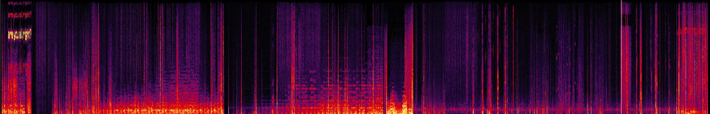

# ARG-20151222

**更新时间 `2025-07-22 19:28`**

## 须知
- 这里是新的文档，旧的文档请见 [README.old.md](README.old.md)
- 更加权威的文档: [https://docs.qq.com/doc/DY0xTQnJSekZtU21P](https://docs.qq.com/doc/DY0xTQnJSekZtU21P)
  
## 目录
- [ARG-20151222](#arg-20151222)
  - [须知](#须知)
  - [目录](#目录)
  - [放在前面](#放在前面)
    - [关于此ARG](#关于此arg)
    - [什么是ARG?](#什么是arg)
    - [加密解密常用工具](#加密解密常用工具)
  - [解析](#解析)
    - [0. 账号信息](#0-账号信息)
    - [1. \[视频\] Coming soon](#1-视频-coming-soon)
    - [2. \[动态\] Post a barrage to proceed to the next step](#2-动态-post-a-barrage-to-proceed-to-the-next-step)
    - [3. \[视频\] record20190722\_085432\_224655](#3-视频-record20190722_085432_224655)

## 放在前面
### 关于此ARG
- 此ARG围绕bilibili@**messager_mc** (旧称: aW50ZXJtZWRpYX 和 bili_20151222, UID: 3546831258651103)展开

### 什么是ARG?
- ARG是一种跨媒体、即时、不可逆的游戏，通常为解密类游戏

### 加密解密常用工具
- [RSA 加密/解密 - 锤子在线工具](https://www.toolhelper.cn/AsymmetricEncryption/RSA)
- [Base64 编码/解码 - 锤子在线工具](https://www.toolhelper.cn/EncodeDecode/Base64)
- [维吉尼亚密码在线加密解密 - 千千秀字](https://www.qqxiuzi.cn/bianma/weijiniyamima.php)
- [在线凯撒密码加密解密](https://www.lddgo.net/encrypt/caesar-cipher)
- [在线摩斯密码翻译器](https://www.lddgo.net/encrypt/morse)

## 解析
### 0. 账号信息
- 昵称 `aW50ZXJtZWRpYX` 经过 Base64 解码后得到 `intermediap`, 作用未知

### 1. [视频] Coming soon
> **动态** Coming soon  
> **时间** 2025-07-18 12:00:54  
> **BV**1augGzwEpr  
> **简介** -

- 视频全程只有文字 `Loading...`，经过画面调节后得到类似信封的图案  
  

- 视频背景音频为低频噪声+高频摩斯电码 `..-. .. -. -.. .-. . -.-. --- .-. -..`，解码后得到 `FindRecord` (寻找录像?)
  
- 也许这是第二季的预告

### 2. [动态] Post a barrage to proceed to the next step
> **时间** 2025-07-18 12:10

- 译为 `发送弹幕以进行下一步`

### 3. [视频] record20190722_085432_224655
> **时间** 2025-07-22 17:24:29  
> **BV**1zagHzTEub  
> **简介** -

- 视频长达9分17秒
- 视频背景音频为低频噪音＋频谱图隐写
    
  开头隐写 `are you all right?`  
    
  结尾隐写 [`www.gonethings.cloud`](https://www.gonethings.cloud)，这是一个网址  
    
  网站标题为 `osrcvbxscxiz` (暂无意义)  
  网页包含很多新闻，页脚为盲文 `from another world`，点击后跳转至 [www.gonethings.cloud/password](https://www.gonethings.cloud/password) (404)  
    
    
  网站有篇文章叫 `这里是你想来的地方吗？`，点击后跳转到 [https://www.gonethings.cloud/archives/1](https://www.gonethings.cloud/archives/1)，该页面有一张地铁站的图片  
    
  图片点击后进入 [https://www.gonethings.cloud/■■■record](https://www.gonethings.cloud/%E2%96%A0%E2%96%A0%E2%96%A0record)  
  页面内容:
  ```
  记录
  2019-08-19 :: 12
  2019年■月■日
  The third 的"■■■"在运行后出现了空指针异常。"异常"？
  
  然而这个的异常并不只是所谓那种一般的"空指针异常"，疑似是某个人间接或直接造成了这个问题。
  
  看来他（他们）已经开始行动了
  
  2019年■月■日
  又是这个问题。
  
  这已经是第■■■个了，以他们的之前的行为和那如此完整的体系，是不可能会犯如此多那同样的错误。可以确  认是他（他们）在干什么"计划"了。
  
  不过那所谓的"宏大计划"，要做到什么程度？
  
  聚众为一以破限，从河流中爬上河岸，他们的野心，当真如此？
  
  2019年■月■日
  已经多久了？还有多久？
  
  "他"或"他们"的计划到了什么地步？
  
  以事实来讲，存在无法把握的"机会"
  
  置身事外，各种意义上都是
  
  如果墙阻挡了光线，就用镜子让光绕过去，这是唯一的方法
  
  2019年■月■日
  ■■仍在和我们■■
  
  事实上，那个异常，已经"修复"了。
  
  但是，他们不打算把"■■■"启动。
  
  依事实而言，这所谓的"计划"，并没有真正"终止"，依■■■的作风，这大概率只是换了个新包装而已
  
  ■■■■年■月■日
  实验记录
  目标一
  第■■号■■，坐标■■■■，■■■■，■■■■
  在■■.■■秒后观察到传输成功迹象
  利用■■■■现象进行传输情况监测
  传输完整性: 47.6%
  信息可识别性: 19.3%
  异常发散程度: 92.1%
  结果: 失败
  看来他们知道我们的■■了
  
  目标二
  第■■号■■，坐标■■■■，■■■■，■■■■
  在传输成功 ■■.■■ 秒后出现衰变异常，出现类似编码规则的量子波段干扰
  结果: 失败
  干扰来源: 显而易见
  ```
  

- 视频为 `yang_rewind`(主视角，简称Y) 和 `Richard_lee`(简称R) 的Minecraft游玩视频，全程黑白，但是有部分彩色片段和隐藏文字
- `00:20` 开门出现异常史蒂夫，随后画面被吸入，闪白，切换场景
  
- `00:57` 闪过文字 `拿上我的装备`
  